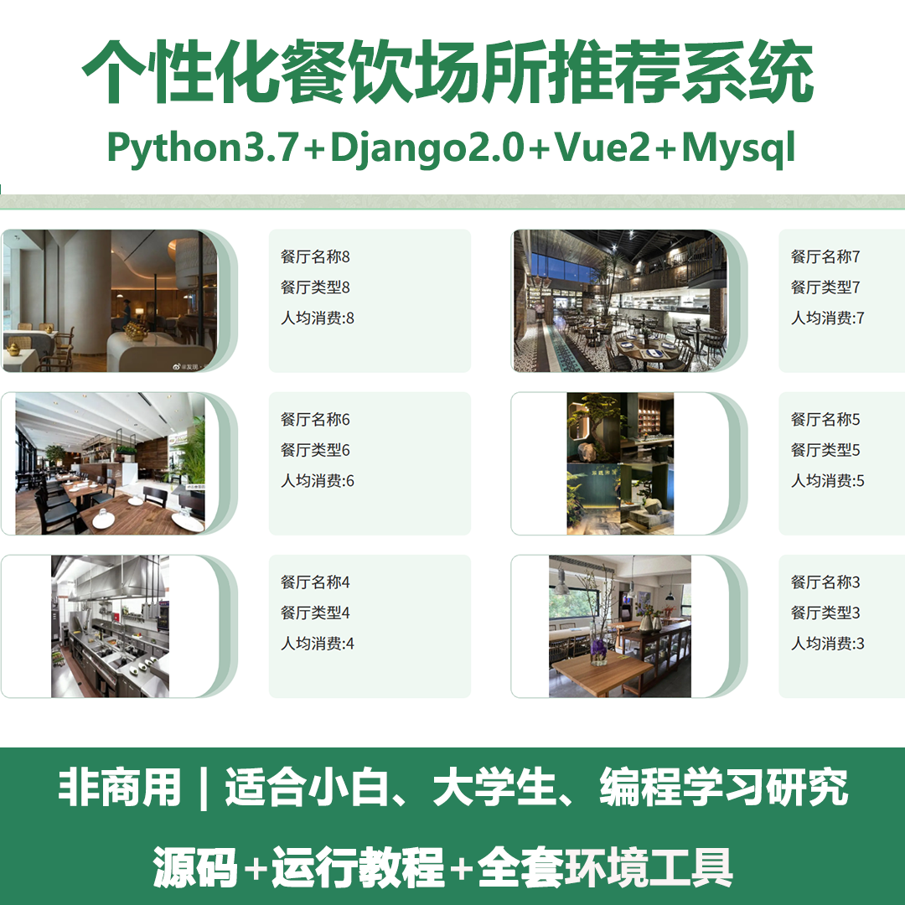
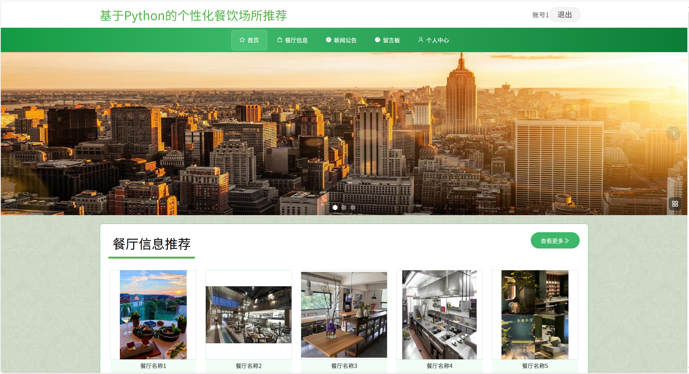
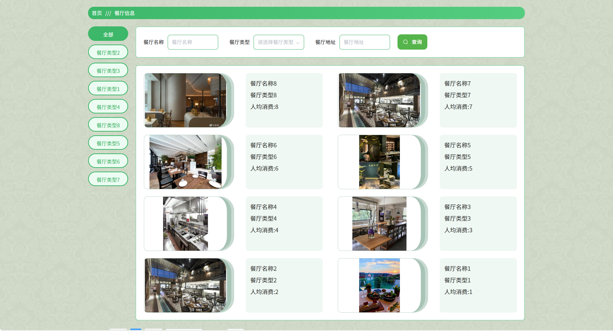
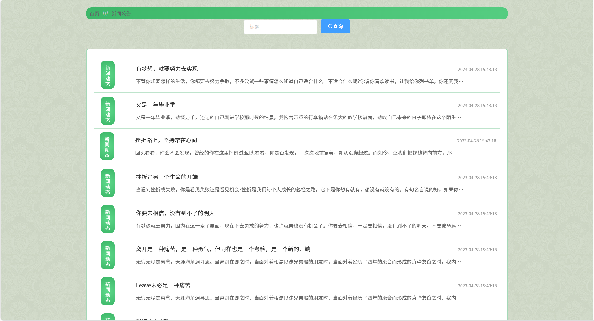
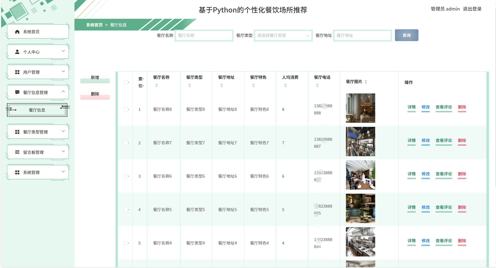
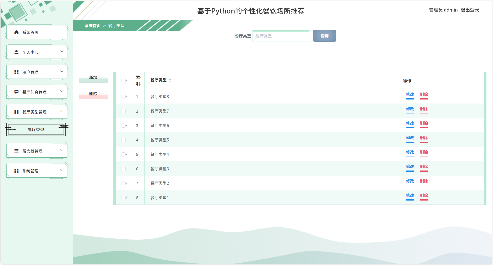
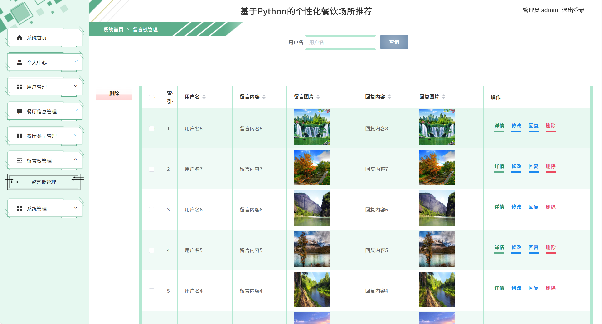
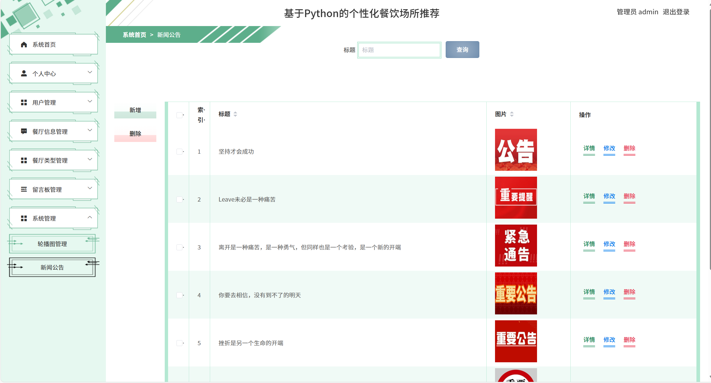

# python093
python093基于Python+Django的个性化餐饮场所推荐系统
 
## 查看主页获取源码

### 一、关键词
个性化餐饮推荐平台，定制化餐厅推荐系统，专属餐厅推荐平台

### 二、作品包含
源码+数据库+全套环境和工具资源+本地部署教程

### 三、项目技术
前端技术：Vue2.0、Element-ui
后端技术：Python3.7、Django2.0

### 四、运行环境（以下版本亲测，其他版本兼容性请自行测试）
开发工具：PyCharm + VSCODE

数据库：MySQL5.7（最低要5.7版本）

数据库管理工具：Navicat10+

Python：Python3.7

前端Nodejs：14

浏览器：谷歌浏览器

### 五、项目介绍
项目编号：python093

个性化餐饮场所推荐系统的核心价值在于通过精准匹配用户需求与餐饮场所特性，让用户高效找到心仪的用餐选择，同时为餐饮商家带来更精准的客流。它就像一位懂你的 “美食向导”，既解决用户选择困难，也为商家提升经营效率。
系统是基于 Python 的个性化餐饮场所推荐系统，用户端可浏览推荐餐厅、查看新闻公告、管理个人信息；管理端能进行餐厅信息、类型、留言板、新闻公告等管理，实现餐饮场所信息的展示与管理。

### 六、运行截图

